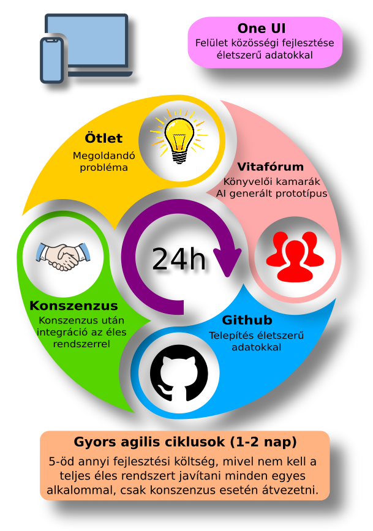

# E-Kozig

A legtöbb közigazgatási fejlesztés (pl. NAV Ügyfélportál) zárt, integrált környezetben készül, így az utólagos módosítás lassú és rendkívül drága. Ha azonban a [felületi prototípus](https://fssrepository.github.io/e-kozig/) már a fejlesztés korai fázisában elérhető a felhasználók számára véleményezésre, a NAV meglepetések nelkül épitheti ki a háttérfolyamatokat, akár 80% költségmegtakarítást elérve. Míg a korai felületi prototípuson végzett korrekció órákban, a későbbi integrált rendszerben végzett javítás hónapokban mérhető.
Ehhez a GitHub integrált környzetet biztosít (pl. [forráskód](https://github.com/fssrepository/e-kozig/), [vitafórum](https://github.com/fssrepository/e-kozig/issues)), ahol a külső szakmai szervezetek (pl. könyvelői kamara) bevonása garantálja a hatékony közös karbantartást és a magasabb minőséget.

